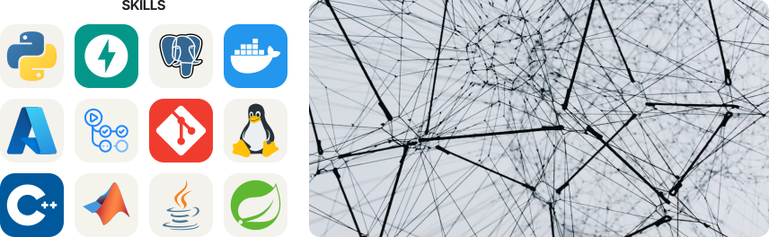
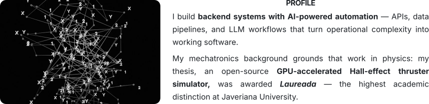

<picture>
  <source media="(prefers-color-scheme: dark)" srcset="assets/hero-v4-dark.svg">
  
</picture>

 

<picture>
  <source media="(prefers-color-scheme: dark)" srcset="assets/rows-b/row1-dark-1.svg">
  
</picture>

  

<picture>
  <source media="(prefers-color-scheme: dark)" srcset="assets/rows-b/row2-dark-3.svg">
  
</picture>

  

<picture>
  <source media="(prefers-color-scheme: dark)" srcset="assets/meta-v4-dark.svg">
  
</picture>

