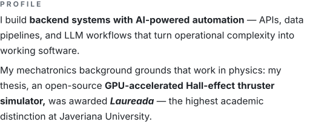

<picture>
  <source media="(prefers-color-scheme: dark)" srcset="assets/hero-dark.svg">
  
</picture>

 

<picture>
  <source media="(prefers-color-scheme: dark)" srcset="assets/skills-dark.svg">
  
</picture>

 

 

<picture>
  <source media="(prefers-color-scheme: dark)" srcset="assets/profile-dark.svg">
  
</picture>

 

 

<picture>
  <source media="(prefers-color-scheme: dark)" srcset="assets/meta-dark.svg">
  
</picture>

<a href="https://www.linkedin.com/in/miguel-angel-cera-contreras"><picture>
  <source media="(prefers-color-scheme: dark)" srcset="assets/link-linkedin-dark.svg">
  
</picture></a>&nbsp;&nbsp;&nbsp;<a href="mailto:miguelangelcera@outlook.com"><picture>
  <source media="(prefers-color-scheme: dark)" srcset="assets/link-email-dark.svg">
  
</picture></a>

