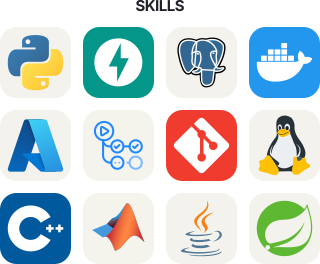
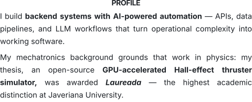

<picture>
  <source media="(prefers-color-scheme: dark)" srcset="assets/hero-v3-dark.svg">
  
</picture>

 

<picture><source media="(prefers-color-scheme: dark)" srcset="{{IMG_WIDE_DARK}}"></picture><picture><source media="(prefers-color-scheme: dark)" srcset="assets/skills-v3-dark.svg"></picture>

 

 

<picture><source media="(prefers-color-scheme: dark)" srcset="{{IMG_TALL_DARK}}"></picture><picture><source media="(prefers-color-scheme: dark)" srcset="assets/profile-v3-dark.svg"></picture>

 

<picture><source media="(prefers-color-scheme: dark)" srcset="assets/meta-v2-dark.svg"></picture>

